# Nand Game Adventures

## 1. `NAND` (opposite of `AND`)

- Only returns **Negative** (`0`) if **both signals (`AND`)** are **positive**

| Input A | Input B | Output |
| ------- | ------- | ------ |
| 0       | 0       | 1      |
| 0       | 1       | 1      |
| 1       | 0       | 1      |
| 1       | 1       | 0      |

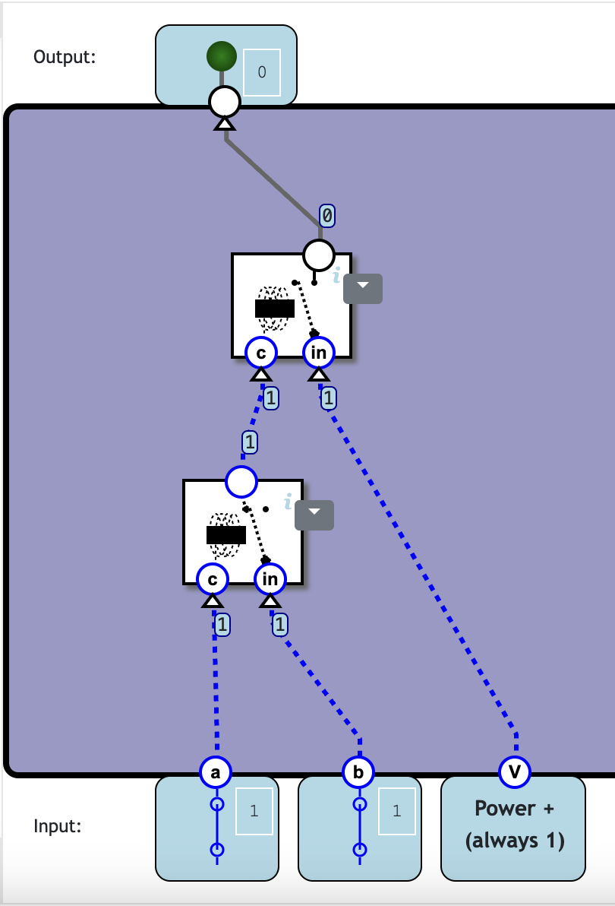

- _Note:_ The "spinny magnetic field" is indeed a **magnetic field** that attracts when powered

## 2. `NOT` (Inverter)

| Input | Output |
| ----- | ------ |
| 0     | 1      |
| 1     | 0      |

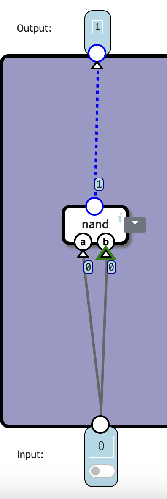

## 3. `AND` (opposite of `NAND`)

- Only returns **Positive** (`1`) if **both signals (`AND`)** are **positive**

| Input A | Input B | Output |
| ------- | ------- | ------ |
| 0       | 0       | 0      |
| 0       | 1       | 0      |
| 1       | 0       | 0      |
| 1       | 1       | 1      |

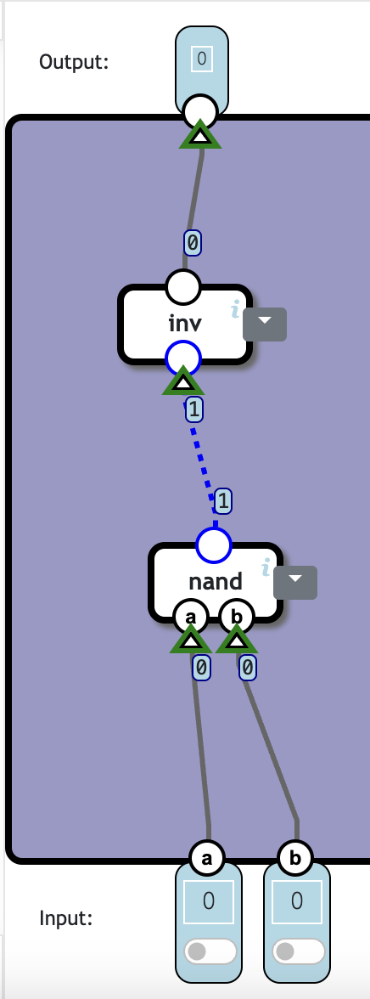

## 4. `OR`

- Returns **Positive** (`1`) if **either signals (`OR`)** are **positive**

| Input A | Input B | Output |
| ------- | ------- | ------ |
| 0       | 0       | 0      |
| 0       | 1       | 1      |
| 1       | 0       | 1      |
| 1       | 1       | 1      |

- We **invert** the inputs into `NAND`

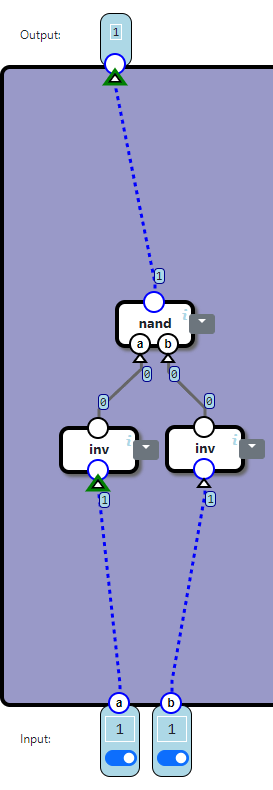

## 5. `XOR` (Exclusive OR)

- Returns **Positive** (`1`) when the inputs are **different**

| Input A | Input B | Output |
| ------- | ------- | ------ |
| 0       | 0       | 0      |
| 0       | 1       | 1      |
| 1       | 0       | 1      |
| 1       | 1       | 0      |

- Sort of a "both gates must agree" to pass

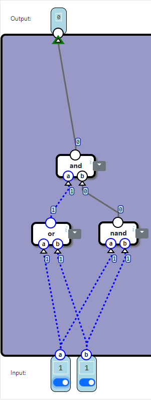

## 6. Half `Adder`

- Adds **`2` `1-bit` numbers**

| A   | B   | Sum (High) | Sum (Low) |
| --- | --- | ---------- | --------- |
| 0   | 0   | 0          | 0         |
| 0   | 1   | 1          | 0         |
| 1   | 0   | 1          | 0         |
| 1   | 1   | 0          | 1         |

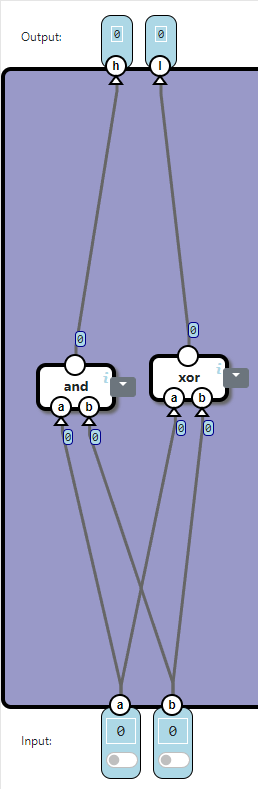

## 6. (Full) `Adder`

- Adds **`3` `1-bit` numbers** into a **`2-bit` value**

| A   | B   | C_in | Sum (S) | Carry-out (C_out) |
| --- | --- | ---- | ------- | ----------------- |
| 0   | 0   | 0    | 0       | 0                 |
| 0   | 0   | 1    | 1       | 0                 |
| 0   | 1   | 0    | 1       | 0                 |
| 0   | 1   | 1    | 0       | 1                 |
| 1   | 0   | 0    | 1       | 0                 |
| 1   | 0   | 1    | 0       | 1                 |
| 1   | 1   | 0    | 0       | 1                 |
| 1   | 1   | 1    | 1       | 1                 |

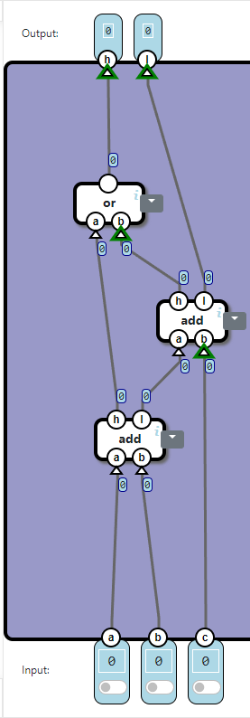

- Adding the **`1-bit` numbers** together (using `add`) and handling the **high-bit** seperartely
  - will \*trigger the **output high-bit\*** either when either addition results in the **addition high-bit** being triggered.

## 6. Multi-Bit `Adder`

- Adds 2 **`2-bit` numbers** and 1 **`1-bit` carry** to form a **`3-bit` number**

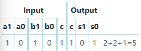

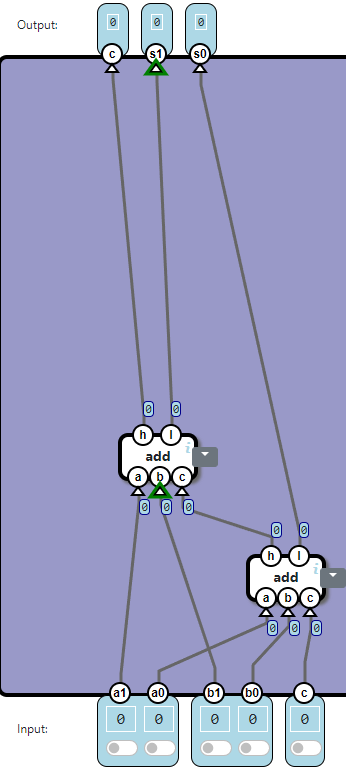

- Combine the **`1-bit`s** to form a **`2-bit` number**
- We now have **3 `2-bits`** and **1 `1-bit`** (connect the **`1-bit`** to `s0`)
  - Sum the `2-bits` and treat the output as a **`3-bit` and `2-bit` output**

## 7. 16-Bit Increments

- Add `1` to a `16-bit Number`

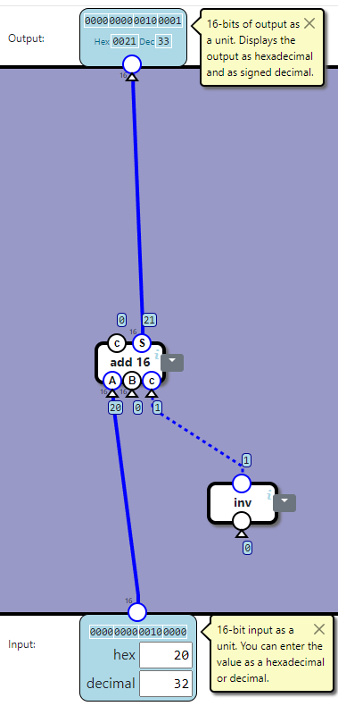

- Simply use the **carry-bit (`1`)**

## 8. 16-Bit Substraction

- **`16-bit Unsigned Integer` range: `0 <= x <= 65536`**
- **`16-bit Signed Integer` range: `-32767 <= x <= 32767`** (because it uses half for the **negative-signs**)
  - ### <u>Two-Complement Representation:</u>
  - In **Decimal:**
    - **Negative Numbers** are represented as `65536 - Overflow`
    - _E.g 65536 - 65535 = 1 - represents `-1`_
  - In **Binary:**
    - `1111111111111110` (if `MSB`==1, it is a `-ve` number)

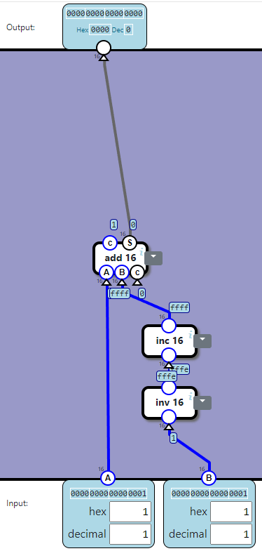

- <u>Note:</u> We need to **<u>add `1`</u>** due to how the 2-complement **inverting** works:
  - When **inverting** `1111111111111110`, we get `0000000000000001`
  - Afterwards, we add `1` and get `0000000000000010` (`2`)
    - _This is part of a "Zero Balance"_
  - Taking into account the **sign (`1`)**, it is a `-ve` and we get `-2`
  - $\therefore$ _We need to "balance it out" by adding `1`_ afterwards
